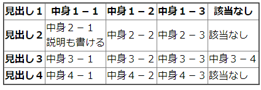

# classroomhelpers
授業の管理に便利なツール用の置き場所

一つのツールとして独立させるまでもないのでまとめて公開しておく。

## スクリプトの使用方法
まず準備として、以下を実行しておく。

システムにgitがなければ、丸ごとダウンロードして解凍して、２行目以降を実行する。

```
> git clone https://github.com/xyslope/classroomhelpers.git
> cd createreport
> pip install -r requirements.txt
> cd ../markdownmatrix
> pip install -r requirements.txt
```

詳しくはこのファイルと、createreportのフォルダに入っているreadme.mdを参照する。

## markdownmatrix：マークダウンを表にする
マークダウン中に表を書くツールではない。

マークダウンでツリー状に書いた文章を表にする。

ルーブリックをマークダウンで書こうと思って作成した。
html, csv, txtに出力可能。
簡単なスクリプトなので、エクスポーターを増やせば、さまざまなスタイルに対応できる。

例えば、こんな文章を用意する。

```
# 見出し１
## 中身１－１
## 中身１－２
## 中身１－３
# 見出し２
## 中身２－１
説明も書ける
## 中身２－２
## 中身２－３
# 見出し３
## 中身３－１
## 中身３－２
## 中身３－３
## 中身３－４
# 見出し４
## 中身４－１
## 中身４－２
## 中身４－３
```

頭の整理時には、こんな感じで思いつくままにツリー状に書くと便利なんだけど、じゃあ、これで全部網羅できてる？とか思うと、少し一覧性が悪い。

表は一覧性が高くていいのだけれど、エクセルで文字の表を編集するのはちょっとつらい。WordやPowerPointだとセルの移動がめんどうだ。

そこで、このツールを使うと、編集はツリー状で行えて、表示を次のような表にできる。



htmlで出力したものは[こちら](markdownmatrix/markdownsource.html)。

現状では、２レベルまでのタイトルを認識して、１レベル目を行（縦）、２レベル目を列（横）に展開した表にする。
１レベル目の数だけ行ができて、１レベルの中にある２レベルの数だけ列ができる。

htmlのばあい、最初の塊（１レベルとその下の２レベル）をヘッダーとする。

ルーブリックに使用する場合、１レベル目が評価軸、２レベル目が評価基準となる。

### 使用方法
スクリプトのあるフォルダにソースファイルをおいて、sオプションでファイル名を指定すると、htmlファイルができる。

```
> python markdonwtomatrix.py -s file.md
```

以下のようなオプションがある。

```
usage: markdowntomatrix.py [-h] [-p SOURCE_PATH] [-s SOURCE_FILE] [-e EXPORT_FORMAT] [-f FILE_FORMAT] [-t]

options:
  -h, --help            show this help message and exit
  -p SOURCE_PATH, --source_path SOURCE_PATH
                        Document root
  -s SOURCE_FILE, --source_file SOURCE_FILE
                        Source Document
  -e EXPORT_FORMAT, --export_format EXPORT_FORMAT
                        Export Format(txt/html/csv
  -f FILE_FORMAT, --file_format FILE_FORMAT
                        Source Format(md/org
  -t, --transpose       Transpose the results
```
## createreport：wordファイルをまとめてpdfに変換して一つにまとめる
文集などを作る際に、複数のファイルをまとめて、一つのPDFを作成する。

Adobeなどを使ってもよいが、何度も微調整を繰り返す必要があるときには便利。

filelist.csvに作成対象のファイルリストを入れておく。いくつかの列があるが、現状で使用しているのはファイル名のみ。

冊子を作る場合など、奇数ページのファイルに空白ページを加えて、全部を同じ側から始めたいという需要がある。
本ツールでは、オプションで空白ページを自動で加える。

また、各ファイルの先頭ページのページ番号を１ページ目からの通算でリストアップして、目次項目とページ番号のリストを出力するので、目次ファイルを作るときに便利。

ソースフォルダのファイルを自動でリストアップしてpdfを作成することもできるが、ファイルの順序が保証されない。現行のfilelist.csvを使ったほうが安全で簡便な気がする。

今後、目次の自動作成機能などを追加したい。その際にはこのファイルの該当列にページ番号を自動で挿入するような機能と目次の自動生成機能をつくる。ただし、目次の自動生成はデザインの問題もあるので、有効かどうかわからない。


### 使い方とオプション
files.csvをおいたディレクトリの中にdocsディレクトリを作成する。docsディレクトリにソースファイルをおく。

コマンドラインから以下のように実行すればファイルが作成される。
```
python makeThesisBook.py
```

コマンドにオプションを追加するには、以下のようにする。-bは各ファイルを必ず奇数ページから始める。-p はファイルの10ページ目からページ番号をつける。

```
python makeThesisBook.py -b -p 10
```


```
python makeThesisBook.py --help
usage: makeThesisBook.py [-h] [-b] [-sc] [-w] [-s SOURCE_PATH] [-dd DOC_DIR]
                         [-o OUT_FILE] [-td TEMP_DIR] [-ww] [-p FROM_PAGENUM]

optional arguments:
  -h, --help            show this help message and exit
  -b, --add_blank       If number of pages is odd, add a blank page.
  -sc, --skip_convert   Skip convert from docx to pdf.
  -w, --wipe_tempdir    Wipe working directory.
  -s SOURCE_PATH, --source_path SOURCE_PATH
                        Document root
  -dd DOC_DIR, --doc_dir DOC_DIR
                        Path to docs
  -o OUT_FILE, --out_file OUT_FILE
                        Path to docs
  -td TEMP_DIR, --temp_dir TEMP_DIR
                        Working directory
  -ww, --wipe_workingfiles
                        wipe working files
  -p FROM_PAGENUM, --from_pagenum FROM_PAGENUM
                        Add page num from page x

```

### 今後の予定
- [*] 通しのページ番号を入れる
- [ ] 目次ファイルの自動生成（これはけっこう難しそうな気がする）


## （リンクのみ）語群からキーワードを選択する問題を作成する
語群選択問題を作成するスクリプト。これもgistレベルだけど、けっこう便利。

https://blog.ecofirm.com/post/createquestionsfromwordlist/

※　GoogleClassroomでテストをするようになってしまって、このような問題を使用する機会が減った。
今後どうするか、要検討。


## （公開予定）basicmarket：簡単な市場メカニズムの図を作成
pythonのMatplotLibで簡単な市場メカニズムの図を作成する。

講義用の図を作るベースとして、自分でよく使っている。すぐ所在を忘れるので、こちらにリンクを張っておく。

この図は、xy軸、需要供給曲線、交点座標の自動抽出、線で囲まれたエリアを塗りつぶす、という機能を使用している。
この図を適宜編集すれば、講義で図を使用する際にかなり楽ができる。


